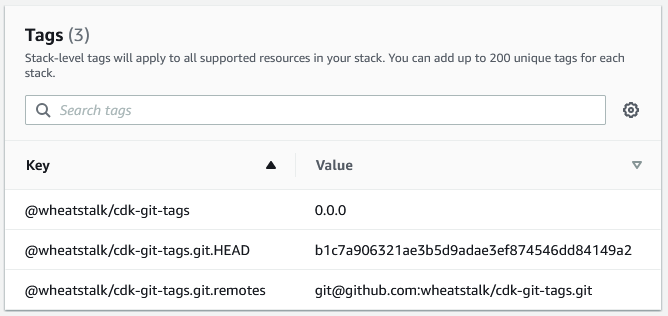

# CDK Git Tags

Use this construct to tag your stack and resources with information from your
git repository.



## Usage

<!-- <macro exec="lit-snip ./test/it/it-lit.ts"> -->
```ts
// Create your CDK app as usual
const app = new cdk.App();

// Apply GitTags to your app and all stacks and resources will be tagged.
GitTags.add(app);
```
<!-- </macro> -->

## Tags Produced

| Tag | Description |
| --- | ----------- |
| `@wheatstalk/cdk-git-tags` | The version of the construct |
| `@wheatstalk/cdk-git-tags.git.HEAD` | The output of `git rev-parse HEAD` |
| `@wheatstalk/cdk-git-tags.git.remotes` | All unique remote URLs separated by spaces |
